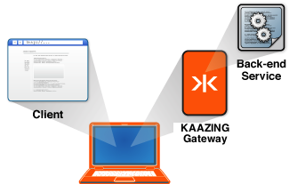
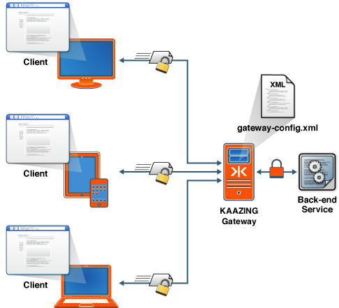

-   [Home](../../index.md)
-   [Documentation](../index.md)
-   Setting Up ${gateway.name.short}

Setting Up ${the.gateway}
=========================

This guide helps you download ${the.gateway} distribution and set it up in your environment:

-   [Setting Up ${gateway.name.short} Locally on My Computer](#localhost_install)
-   [Setting Up ${gateway.name.short} on a Server](#server_install)
-   [Setting Up a Secure ${gateway.name.short} Configuration](#secure_install)
-   [Uninstall ${gateway.name.short}](#uninstall)

Let's get started!

<span id="localhost_install"></span></a>Setting Up ${gateway.name.short} Locally on My Computer
-----------------------------------------------------------------------------------------------

Setting up ${gateway.name.short} on your local computer is recommended if you want to quickly try out ${the.gateway}.

<figure>

<figcaption>

**Figure: A Localhost Configuration for ${gateway.name.short}**

</figcaption>
</figure>
To download and set up ${the.gateway} on your local computer, perform the following steps:

1.  Ensure your system meets the system requirements. ${sys.reqs.gs}
2.  Download ${the.gateway} or fork ${the.gateway} GitHub repository from [kaazing.org](http://kaazing.org):
    -   For Linux, Unix, and Mac: kaazing-gateway-community-${gateway.version}.*x*-unix.tar.gz
    -   For Windows: kaazing-gateway-community-${gateway.version}.*x*-windows.zip

3.  Install ${the.gateway} by unpacking the compressed download of ${the.gateway}.

    Unpack ${the.gateway} to any directory location. Unpacking creates the Gateway directory structure into a directory of your choice (for example, `C:\kaazing` or `/home/username/kaazing`). See [About GATEWAY\_HOME](../about/about.md#gatewayhome) to learn more about ${gateway.name.long} directory destinations.

4.  Start ${the.gateway}.

    -   For Windows: use the Windows Services Manager or use the `net start` command with administrator rights. Alternatively, in Windows Explorer, navigate to the `GATEWAY_HOME/bin` directory where you unpacked ${the.gateway} and double-click the `gateway.start.bat` script.
    -   For Linux: `sudo service kaazing-gateway-community-${gateway.version}.x-platform start`
    -   For Ubuntu (Upstart): `sudo start kaazing-gateway-community-${gateway.version}.x-platform`
    -   For Linux, UNIX, or Mac: run the `gateway.start` script by navigating to the `GATEWAY_HOME/bin` directory where you installed ${the.gateway} and enter `./gateway.start` on the command line.

    When you successfully start ${the.gateway}, messages display in your shell or command prompt indicating the services that are hosted by ${the.gateway}. The startup message may differ depending on your Gateway configuration. To verify that ${the.gateway} started correctly as a service, look at the log file in `GATEWAY_HOME/log/service.log` that is generated when the service is started or stopped. If the server does not start successfully, see [Troubleshoot ${gateway.name.short} Configuration and Startup](../troubleshooting/ts_config.md) or contact your administrator.

5.  Verify ${the.gateway} setup.

    To verify that ${the.gateway} is up and running, open a browser and access ${the.gateway} home page at `http://localhost:8000/`. The "It Works!" page displays and automatically starts a simple WebSocket demo. Also try clicking "${console.name}" on this page to view ${the.gateway} with a browser-based application that is provided in the default ${gateway.cap} configuration. See [Monitor with ${console.name}](../management/p_monitor_cc.md) for instructions.

You are now done setting up ${the.gateway} locally.

-   To start building your first application, see the [For Developers](../index.md#dev_topics) documentation topics.
-   For more information about configuration settings and to perform additional ${gateway.cap} configuration, see [About ${gateway.cap} Configuration](../admin-reference/c_conf_concepts.md).
-   For real-world demos, see <http://kaazing.org/>.
-   To uninstall ${the.gateway}, see the [Uninstall ${gateway.name.short}](#uninstall) section at the end of this document.

<span id="server_install"></span></a> Setting Up ${gateway.name.short} on a Server
----------------------------------------------------------------------------------

You can override ${the.gateway} default behavior and accept connections on a non-localhost host name or IP address.

<figure>

<figcaption>

**Figure: A Server Configuration for ${gateway.name.short}**

</figcaption>
</figure>
To set up a server configuration:

1.  Follow the directions in [Setting Up ${gateway.name.short} Locally on My Computer](#localhost_install).
2.  Stop ${the.gateway}.
    -   To stop ${the.gateway} on Windows, use the Windows Services Manager, press CTRL + C at the command prompt that was used to start ${the.gateway} or simply close the command prompt, or use the `net stop` command to stop ${the.gateway} service.
    -   To stop ${the.gateway} on Linux, UNIX, and Mac, kill the process at the command line, or use the Linux or Ubuntu (Upstart) service `stop` command.

3.  Navigate to the `GATEWAY_HOME/conf/` directory and edit ${the.gateway} configuration to update the value of the `gateway.hostname` property by replacing `localhost` with your host name or IP address.
    1.  Edit either of ${the.gateway} configuration file options: `gateway-config.xml` or `gateway-config-minimal.xml,` or edit your custom configuration file if you created one. ${the.gateway.cap} configuration files are described in detail in [About ${gateway.cap} Configuration](../admin-reference/c_conf_concepts.md).
    2.  Replace `localhost` with your host name or IP address.

        For example, the hostname `example.com` replaces `localhost` in the "Property defaults" section of the following Gateway configuration file:

        ``` auto-links:
        <properties>
          <property>
            <name>gateway.hostname</name>
            <value>example.com</value>
          </property>
          <property>
            <name>gateway.base.port</name>
            <value>8000</value>
          </property>
          <property>
            <name>gateway.extras.port</name>
            <value>8001</value>
          </property>
        </properties>
        ```

        **Note:** You can optionally specify default values for configuration elements using the `properties` element in the "Property defaults" section of ${the.gateway} configuration file. Doing so is recommended because it allows you to define a property value once and have its value used throughout the configuration.

4.  If you are using a message broker, start it.
5.  Start and verify ${the.gateway} (as described in [Setting Up ${gateway.name.short} Locally on My Computer](#localhost_install)).

<span id="secure_install"></span></a>Setting Up a Secure ${gateway.name.short} Configuration
--------------------------------------------------------------------------------------------

By default, ${the.gateway} listens for non-encrypted traffic. Secure communication between the browser and the server is necessary to ensure that only the intended recipient of a message can read the transmitted message and to allow the message recipient to trust that the message is indeed from the expected source.

<figure>

<figcaption>

**Figure: An Encrypted Configuration Using ${gateway.name.short}**

</figcaption>
</figure>
For secure communication with ${the.gateway}, consider configuring for the following levels of security:

-   **Secure network traffic** Configure Transport Layer Security (TLS, also known as SSL) for secure communications channels to access ${the.gateway} by setting up certificates. See [Secure Network Traffic with ${the.gateway}](../security/o_tls.md) for more information.
-   **Limit access to services** Use Cross-Origin Resource Sharing to control access to Gateway services based on the origin of an application by configuring cross-site constraints in the `gateway-config.xml` file. See [Configure the HTTP Challenge Scheme](../security/p_aaa_config_authscheme.md) for more information.
-   **Configure authentication and authorization** with constraints to limit access to Gateway services to authenticated and authorized users. See [Configure Authentication and Authorization](../security/o_aaa_config_authentication.md) for more information.
-   **Configure Kerberos network authentication**${enterprise.logo} for network authentication and communication between trusted hosts on untrusted networks. See [Configure Kerberos V5 Network Authentication](../security/o_krb.md) for more information.

<a name="uninstall"></a>Uninstall ${gateway.name.short}
-------------------------------------------------------

Uninstall ${the.gateway} by stopping all the services and deleting the directory that contains ${the.gateway} files.


