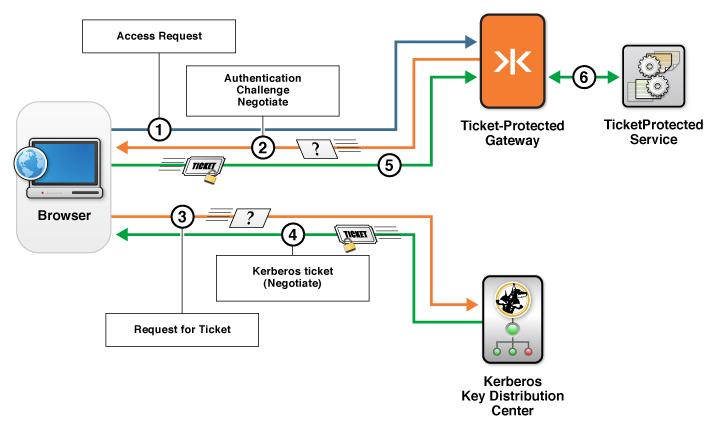

-   [Home](../../index.md)
-   [Documentation](../index.md)
-   [Security with ${gateway.name.short}](../index.md#security)

<a name="howto_kerberos"></a>Configuring Kerberos V5 Network Authentication Overview${enterprise.logo}${enterprise.logo.jms}
============================================================================================================================

${gateway.name.short} can be configured to accept a Kerberos service ticket (Ticket-Protected Gateway or TPG) from a browser client using a standard `Negotiate` challenge. Additionally, if you want to combine a TPG with a Ticket Granting Gateway (TGG) to proxy Kerberos protocol traffic from clients to a KDC, then you can configure the TPG to use the `Application Negotiate` challenge, which sends the Kerberos authentication protocol traffic over WebSocket to a TGG.

Before You Begin
----------------

This procedure is part of [Configure Kerberos V5 Network Authentication](o_krb.md):

1.  **Configuring Kerberos V5 Network Authentication Overview**
2.  [Configure a Ticket Protected Gateway](p_krb_config_tpg.md)
3.  [Configure a Ticket Granting Gateway](p_krb_config_tgg.md)

<a name="nas"></a>How Does the Negotiate Authentication Scheme Work?
--------------------------------------------------------------------

In this configuration, access to a Kerberos ticket protected service is achieved as shown in the following figure:

<figure>

<figcaption>

**Figure: Negotiate authentication challenge to a Kerberos ticket protected service**

</figcaption>
</figure>
1.  A client running in the browser tries to access a ticket-protected service through a Ticket Protected Gateway (TPG).
2.  TPG sends the `Negotiate` authentication challenge to the browser. `Negotiate` is a standard feature that programs such as the web browser can leverage to request an encrypted Kerberos ticket.
3.  The browser requests the ticket directly from the KDC.
4.  The KDC returns an encrypted ticket. This negotiation is done over TCP or UDP.
5.  The browser responds to the challenge from the TPG with the encrypted ticket.
6.  If the ticket is valid, the client is granted access the ticket-protected service through a TPG.

<a name="anas"></a>How Does the Application Negotiate Authentication Scheme Work?
---------------------------------------------------------------------------------

In this configuration, a TPG and a Ticket Granting Gateway (TGG) proxy Kerberos protocol traffic from clients to a KDC. (The TPG is configured with the `Application Negotiate` authentication scheme to challenge clients.) The configuration uses both a TPG and a TGG to send the Kerberos authentication protocol traffic over WebSocket to the Ticket-Protected Service, as shown in the following figure:

<figure>

<figcaption>

**Figure: Application Negotiate authentication using a TPG and a TGG to proxy Kerberos protocol traffic from clients to a KDC**

</figcaption>
</figure>
1.  A ${gateway.name.long} client running in the browser tries to access a ticket-protected service through a Ticket Protected Gateway (TPG).
2.  The TPG sends the authentication challenge `Application Negotiate` to the browser. `Application Negotiate` is the ${gateway.name.long} feature that allows a client to use the Kerberos authentication protocol over WebSocket.
3.  The client requests a ticket from the Ticket Granting Gateway (TGG).
4.  The TGG proxies the request to the KDC.
5.  The KDC returns an encrypted ticket (session ticket) to the TGG.
6.  The TGG returns the encrypted ticket to the browser.
7.  The ${gateway.name.long} client responds to the challenge with the ticket.
8.  On successful validation of the ticket, access is granted and the client can access the ticket-protected service through Ticket-Protected Gateway (TPG).

In this scenario, by configuring ${gateway.name.long} to use Kerberos, you enable your browsers and ${gateway.name.long} clients to take advantage of your Kerberos security to authenticate with ${gateway.name.long}.

**Note:** You can configure one ${gateway.cap} as a TPG and another ${gateway.cap} as a TGG or you can configure a single ${gateway.cap} as both the TPG and TGG.
The following example shows a sample `gateway-config.xml` entry for using Kerberos security. In this example, a service with type `kerberos5.proxy` is added, accepts connections on `wss://localhost:9000/kerberos5`, and connects over `tcp://kerberos.example.com:88` to the Kerberos Key Distribution Center. The authentication scheme is `Application Negotiate`, which tells ${the.gateway} to challenge the ${gateway.name.long} client for a Kerberos ticket. When ${the.gateway} receives the ticket, it sends the ticket to the URI specified in the ${gateway.name.long} client Kerberos challenge handler (see [Notes](o_krb_config_kerberos.md#notes) below). A `kerberos5` login-module includes sample configuration options, and is followed by the `gss` login-module that is required for SPNEGO-based Kerberos security.

##### Ticket Granting Gateway (TGG)

``` auto-links:
<service>
    <accept>wss://example.com:9000/kerberos5</accept>
    <connect>tcp://kerberos.internal.example.com:88</connect>
    <type>kerberos5.proxy</type>
    <cross-site-constraint>
        <allow-origin>*</allow-origin>
    </cross-site-constraint>
</service>
```

##### Ticket Protected Gateway (TPG)

``` auto-links:
<security>
     <realm>
        <name>demo</demo>
        <authentication>
            <http-challenge-scheme>Application Negotiate</http-challenge-scheme>
          </authentication>
        <login-module>
            <type>kerberos5</type>
            <success>required</success>
            <options>
                <useKeyTab>true</useKeyTab>
                <keyTab>/etc/krb5.keytab</keyTab>
                <principal>HTTP/localhost@LOCAL.NETWORK</principal>
                <isInitiator>false</isInitiator>
                <doNotPrompt>true</doNotPrompt>
                <storeKey>true</storeKey>
            </options>
        </login-module>

        <login-module>
            <type>gss</type>
            <success>required</success>
        </login-module>
    </realm>
</security>
```

Next Steps
----------

[Configure a Ticket Protected Gateway](p_krb_config_tpg.md)

<a name="seealso"></a>See Also
------------------------------

-   [Configure ${the.gateway}](../admin-reference/o_conf_checklist.md) for more configuration information and examples
-   [About Kerberos V5 Network Authentication](c_aaa_kerberos.md)
-   [Using Kerberos V5 Network Authentication with ${the.gateway}](u_krb_config_kerberos.md)

<a name="notes"></a>Notes
-------------------------

-   For information on creating ${gateway.name.long} client Kerberos challenge handlers, see the [Howto](../index.md#dev_topics) documentation for developers.
-   The `session` element has been deprecated. For more information, see the [Session Reference](../admin-reference/r_conf_session.md) documentation.


