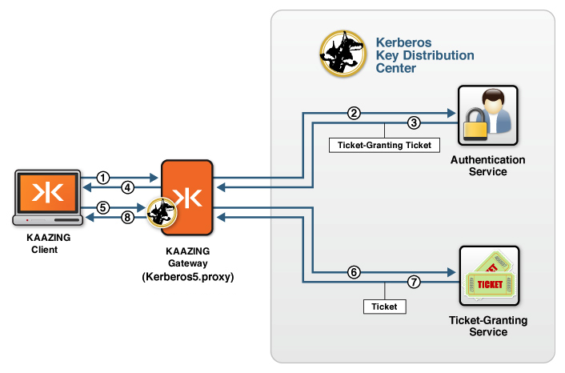

-   [Home](../../index.md)
-   [Documentation](../index.md)
-   Using Kerberos V5 Network Authentication with ${the.gateway}

Using Kerberos V5 Network Authentication with ${the.gateway}${enterprise.logo}${enterprise.logo.jms}
=================================================================================================================================

${gateway.name.short} supports the Kerberos authentication protocol, allowing you to proxy traffic to and from a KDC. This enables clients to communicate to a KDC over WebSocket. A gateway that is configured to proxy Kerberos traffic will be called a Ticket-Granting Gateway (TGG) in this section. This architecture provides all the benefits of a Kerberos-based security system to Web-based clients, without having to compromise overall site security by placing a KDC closer to the edge of the network.

<figure>

<figcaption>

**Figure: ${the.gateway} is configured to proxy Kerberos traffic as a TGG**

</figcaption>
</figure>
1.  A ${gateway.name.long} client running in a browser makes a request for a ticket from a TGG using a WebSocket-based connection.
2.  The TGG front-ends the KDC and proxies the incoming requests to the KDC, sending a request for a ticket-granting ticket (TGT) to the AS in the KDC.
3.  The AS returns a TGT.
4.  The TGG sends the TGT to the ${gateway.name.long} client.
5.  The ${gateway.name.long} client now makes a request for a ticket from a TGG using the TGT.
6.  The TGG sends the TGT to the ticket-granting service (TGS) in the KDC to get an encrypted ticket.
7.  The TGS returns encrypted ticket (the session ticket).
8.  The TGG proxies the encrypted ticket to the ${gateway.name.long} client and it can now be used to access another service.

You can configure ${the.gateway} to use the services of a KDC to provide Kerberos authentication for ticket-protected services running on the ${gateway.name.short}. In this document, we will call a gateway that is configured that way a Ticket Protected Gateway (TPG).

See Also
------------------------------

-   [Configure Kerberos V5 Network Authentication](o_krb.md)
    -   [Configure a Ticket Protected Gateway](p_krb_config_tpg.md)
    -   [Configure a Ticket Granting Gateway](p_krb_config_tgg.md)

