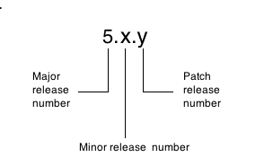

-   [Home](../../index.md)
-   [Documentation](../index.md)
-   [Upgrade KAAZING Gateway](../index.md#security)

About KAAZING Gateway Releases and Upgrades
==================================================================================================

The KAAZING Gateway release number consists of three digits separated by dots, with software changes denoted in order of major, minor, and maintenance release numbers. For example, KAAZING Gateway release 5.*x*.*y* is represented as:

You can upgrade KAAZING Gateway to a newer Gateway release that has a higher major or minor release number, or patch your current Gateway release (such as from release 4.0.5. to 4.0.7).

You can find the release number on the Command Center console, on the KAAZING download page, in `README.txt`, or in the Gateway startup log.

Supported Gateway Upgrade Paths
-----------------------------------------------------------------

The following table shows the supported paths for Gateway upgrades (major and minor) and patch release updates.

| If your current Gateway release is... | And you want to upgrade to Gateway release ... | Then follow these upgrade instructions ...              | And consider the impact on KAAZING client migration and backward compatibility \*               |
|---------------------------------------|------------------------------------------------|---------------------------------------------------------|-------------------------------------------------------------------------------------------------|
| 4.0.x               | 5.0.*x* (for example, 4.0.5 to 5.0.2)         | [Upgrade the Gateway](o_upgrade.md)                     |                                                                                                 | |

\* See [KAAZING Clients and Backward Compatibility](#kaazing-clients-and-backward-compatibility)

Upgrade Options
--------------------------------------------

You can use the Windows or Linux installer to install the Gateway into conventional (default) operating system locations or you can choose to unpack the .zip for Windows or .tar.gz for Linux, UNIX, or Mac) into any directory location:

-   Run the Windows or Linux installer to install the Gateway into conventional operating system locations and automatically run the Gateway as a service. The newer release is installed in a separate `_KAAZING\_HOME_` that is at the same level in the directory structure as the `_KAAZING\_HOME_` for the earlier release. Earlier releases are not overwritten or removed. For example, `jms/4.0` and `jms/5.0` are separate but parallel directories. [About `KAAZING_HOME`](../about/about.md#about-kaazing_home) describes `KAAZING_HOME` in more detail.

    **Note:** You cannot run both releases at the same time unless you change the ports on one or the other. You cannot run two Gateways on the same hostname and port.
-   Unpack the .zip for Windows or .tar.gz for Linux, UNIX, or Mac and then uncompress the Gateway to any directory location and run it in place. You must take care to save user-modified files (such as the `gateway-config.xml` file) if you install the newer release in the same `_KAAZING\_HOME_` as the earlier release. Earlier releases of the Gateway will be overwritten or removed.

Download and installation options are discussed in more detail in [Setting Up KAAZING Gateway](../about/setup-guide.md).

KAAZING Clients and Backward Compatibility
------------------------------------------------------------------------------

KAAZING Gateway provides backward compatibility for clients written using the KAAZING Gateway (release 4.0.*x* through 5.0.*x*) APIs. Backward compatibility guarantees that you can use older clients (4.0.*x* or higher release) in a newer Gateway installation. However, to take advantage of new features, you must migrate your Java and JavaScript clients by migrating JavaScript and Java clients built using the KAAZING Gateway 4.0 or higher libraries and APIs to the KAAZING Gateway 4.*x* libraries and APIs. KAAZING Gateway 4.0 supports all clients written using the KAAZING Gateway 4.0 or higher APIs. You do not need to migrate your legacy (Flash, .NET, or Silverlight) clients to use KAAZING Gateway 4.0.

**Note:** If you are using your own WebSocket client (not a client built using the KAAZING client APIs) do not migrate your clients using the instructions in this documentation. See the [developer how-tos](../index.md) for information about how to integrate your client with KAAZING Gateway according to your platform.

See Also
------------------------------

-   [Upgrade the Gateway](o_upgrade.md)
-   [Migrate the Gateway Configuration](p_migrate_gwconfig.md)
